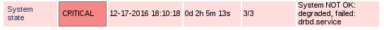

check_systemd_state
===================

Nagios plugin to check the system state according to systemd. This plugin checks
the system's state according to systemd, i.e.

    $ systemctl is-system-running
    degraded

If it reports anything other than "running", be sure to check the output of
these commands:

    $ systemctl list-units
    $ systemctl status

Requires python3-dbus.

License: Public Domain. Keep my name in it if you like.
Author:  Mike Gerber 2015, 2016, 2021
